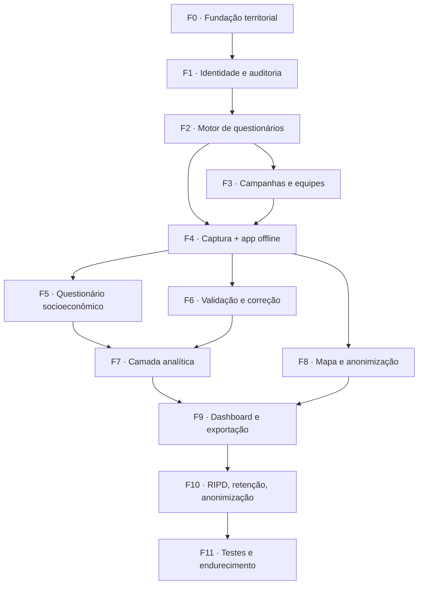

# Diagnóstico Socioeconômico — Plano de Execução

> **Documento irmão:** `docs/diagnostico-socioeconomico-spec.md` (análise e
> especificação ajustada). Este aqui é o **como**: fases, migrations
> numeradas, arquivos, testes e pontos de verificação.
> **Status:** plano proposto. Nada implementado.

---

## 0. Premissas assumidas

Assumidas para o plano não ficar bloqueado. Todas revisáveis — a coluna
"até quando" diz quando cada uma vira irreversível na prática.

| # | Premissa | Base | Irreversível a partir de |
|---|---|---|---|
| 1 | Stack HTML/JS vanilla | `CLAUDE.md` já decide | Fase 2 |
| 2 | Coleta por **domicílio**, análise por **família** | padrão IBGE | Fase 4 |
| 3 | Validação de entrevista só na mesa (não no app) | reduz escopo da v1 | Fase 6 |
| 4 | Vídeo fora; áudio ≤ 2 min | §2.6 da spec ajustada | Fase 2 |
| 5 | Índices entregues como `PROVISÓRIO` | §2.9 da spec ajustada | Fase 7 |
| 6 | Módulo P sem georreferenciamento por família | §2.1 da spec ajustada | Fase 4 |

Se qualquer uma mudar depois do marco, o custo deixa de ser "editar o
plano" e passa a ser retrabalho de código e migration de dados.

---

## 1. Numeração e convenções

- Migrations de **226 a 256** (a última aplicada hoje é a 225).
- Prefixo `diag_`, exceto `municipios` — infraestrutura compartilhada,
  não pertence a este módulo.
- Chaves no catálogo `modulos`: `diagnostico` (escopo por UC) e
  `diagnostico-admin` (sem escopo).
- Grupo novo na sidebar: **Diagnóstico**.
- 4º PWA: `pages/diagnostico-app.html`, scope próprio no `pwa/sw.js`.

---

## 2. Dependências entre fases



F3 e F4 podem correr em paralelo depois da F2. Tudo o mais é sequencial.

**A LGPD não é a fase 10.** Cada fase que cria tabela com dado pessoal já
entra com RLS e com sua linha no ROPA, na mesma entrega — regra do
`CLAUDE.md`. A F10 fecha o que só faz sentido com o conjunto pronto: RIPD,
retenção e anonimização.

---

## 3. Fases

### F0 · Fundação territorial

**Por que primeiro:** a RLS de tudo o que vem depois depende de
`pode_ver('diagnostico')`, que devolve `sem_acesso` se o módulo não existir
no catálogo. E `diag_comunidades` é a entidade que hoje falta no sistema
inteiro — Brigadas e Biomonitor guardam comunidade como texto livre.

| Migration | Conteúdo |
|---|---|
| `226_diag_catalogo_modulos.sql` | INSERT de `diagnostico` e `diagnostico-admin` em `modulos`; seeds em `grupo_permissoes_padrao` e `perfil_permissoes_padrao` |
| `227_municipios.sql` | tabela `municipios` (código IBGE, nome, geometria, GIST), carga dos 22 do Acre a partir de `data/municipios_acre.geojson` |
| `228_diag_comunidades_localidades.sql` | `diag_comunidades` (UC, município, tipo, ponto + polígono opcional) e `diag_localidades` (colocação, lote, ramal, rio, igarapé) |

**Web:** `pages/diagnostico-territorio.html` (cadastro, duas abas).

**Testes:** usuário sem permissão no módulo não lê comunidade; `gestor_uc`
sem `usuario_ucs_extras` da UC X não lê comunidade de X.

**Pronto quando:** o item aparece na sidebar só para quem tem permissão, e
é possível cadastrar comunidade e localidade de ponta a ponta.

> `municipios` sem prefixo é decisão consciente: Brigadas e Biomonitor vão
> poder referenciá-la depois. O texto livre atual continua funcionando — a
> referência entra como coluna opcional, sem quebrar nada.

---

### F1 · Identidade do entrevistador e auditoria

| Migration | Conteúdo |
|---|---|
| `229_diag_auditoria.sql` | `diag_auditoria` + função de trigger genérica (INSERT/UPDATE/DELETE lógico), RLS **append-only** — sem policy de UPDATE/DELETE, como `lgpd_aceites` |
| `230_diag_entrevistadores.sql` | tabela ligada a `auth.users`, PIN, equipe, foto em bucket privado; `is_entrevistador()` SECURITY DEFINER; **linha no ROPA** |
| `231_diag_entrevistador_sessoes.sql` | sessões e log de atividade, molde de `brigadista_iniciar_sessao` |

`is_entrevistador()` como SECURITY DEFINER é a lição da migration 050 —
sem isso a RLS entra em recursão ao consultar a própria tabela.

**Testes:** usuário comum não apaga linha de `diag_auditoria` (testado por
tentativa direta no banco, não por ausência de botão).

---

### F2 · Motor de questionários

O coração do módulo. Sem ele nada mais existe.

| Migration | Conteúdo |
|---|---|
| `232_diag_enums_questionario.sql` | enums `tipo_pergunta`, `status_questionario`, `acao_condicional`. **Migration própria** — valor de enum só pode ser usado depois de commitado (erro real já visto nas 217/219) |
| `233_diag_questionarios.sql` | `diag_questionarios`, `_versoes`, `_secoes`, `_perguntas`, `_opcoes`; publicado é imutável (trigger bloqueia UPDATE) |
| `234_diag_condicional.sql` | `diag_regras_condicionais` + validação de referência circular |
| `235_diag_rpc_pacote_questionario.sql` | RPC que devolve a versão publicada inteira em um JSON — o app baixa tudo numa chamada |

**Web:** `pages/diagnostico-questionarios.html` (construtor),
`js/diagnostico-condicional.js` (motor de regras, **compartilhado** entre
construtor e app — uma implementação só, mesma lição do `frota-consumo.js`).

**Tipos de pergunta entregues:** texto curto/longo, inteiro, decimal,
moeda, data, hora, sim/não, escolha única, múltipla, lista, busca, Likert,
matriz, tabela repetitiva, GPS, foto, áudio, assinatura, upload.
**Fora:** vídeo (§2.6 da spec ajustada).

**Testes:** publicar v2 não altera nenhuma linha de resposta da v1; regra
que encerra a entrevista impede resposta posterior **no banco**, não só na
tela; alteração de questionário publicado é rejeitada.

**Pronto quando:** dá para montar um questionário de 3 seções com
condicional, publicar, e a RPC devolver o pacote completo.

---

### F3 · Campanhas, equipes e anuência

| Migration | Conteúdo |
|---|---|
| `236_diag_campanhas_equipes.sql` | `diag_campanhas`, `diag_equipes`, `diag_equipe_membros`, `diag_atribuicoes`; status Planejada→Em execução→Suspensa→Concluída→Arquivada |
| `237_diag_anuencias.sql` | anuência coletiva por comunidade — pré-requisito para iniciar campanha ali (§2.2 da spec ajustada) |

**Web:** `pages/diagnostico-campanhas.html`, com **estimativa de duração**
somando os blocos ativos e aviso acima de 90 min (§2.8).

**Pronto quando:** campanha criada, equipe montada, entrevistas
distribuídas, e a campanha recusa iniciar em comunidade sem anuência.

---

### F4 · Captura e app de campo offline

A maior fase. Sozinha vale mais que Frota inteira.

| Migration | Conteúdo |
|---|---|
| `238_diag_familias_domicilios.sql` | `diag_familias` (código estável — é o que permite reentrevista em 2031), `diag_domicilios`, `diag_moradores`, `diag_areas_uso` (**sem tipo "caça"**) |
| `239_diag_entrevistas_respostas.sql` | `diag_entrevistas`, `diag_respostas`, `diag_respostas_repet`, `diag_aceites`, `diag_midias`, `diag_percepcao_fauna` (RLS estrita), `diag_saberes` |
| `240_diag_rpc_enviar_entrevista.sql` | envio **idempotente por `uuid_cliente`**, transacional (entrevista + respostas + mídias ou nada) |
| `241_diag_buckets_midias.sql` | buckets `diag-*` privados desde o nascimento, leitura por signed URL |
| `242_lgpd_ropa_diagnostico.sql` | tratamentos novos, incluindo o de **dado de menor** marcado como tal |
| `243_lgpd_enum_app_diagnostico.sql` | valor `diagnostico` para a coluna `app` de `lgpd_documentos` |
| `244_lgpd_aviso_campo_diagnostico.sql` | aviso de campo próprio do app — **o app não vai a campo sem isso** |

**Web:**
```
pages/diagnostico-app.html        4º PWA
pages/instalar-diagnostico.html   instalação/atualização
js/diagnostico-offline.js         IndexedDB
js/diagnostico-sync.js            fila + retry + idempotência
js/diagnostico-render.js          renderiza pergunta por tipo
css/diagnostico.css
pwa/sw.js                         VERSOES.diagnostico = 1 + SHELLS + scope
```

`window.LGPD_CAMPO_APP = 'diagnostico'` antes de `lgpd-campo.js` — o cache
do aviso é por app, senão dois apps na mesma origem se sobrescrevem.

**A idempotência não é refinamento.** Um envio carrega ~300 respostas mais
fotos. Sem `uuid_cliente`, uma reconexão no meio duplica a entrevista ou
envenena a fila — exatamente o que a migration 198 teve que consertar no
Frota depois de acontecer.

**Testes:** entrevista completa em modo avião sobrevive a fechar e reabrir
o app; reenvio do mesmo `uuid_cliente` não duplica; fila de 30 entrevistas
com queda de conexão no meio não perde nem duplica nada.

**Pronto quando:** um entrevistador faz entrevista inteira sem sinal,
sincroniza depois, e o coordenador vê na mesa.

---

### F5 · Questionário socioeconômico como configuração

| Migration | Conteúdo |
|---|---|
| `245_diag_bloco_ebia.sql` | EBIA como **bloco selado** (`editavel = false`), versões de 14 e 8 itens, escolha automática pela presença de menor no domicílio, escore calculado no banco |
| `246_diag_seed_questionario_v1.sql` | carga da v1.0: módulos A–Z e especiais, como INSERT |

A fonte do questionário vive em `data/diagnostico-questionario-v1.json`,
versionado no repositório e legível por quem não lê SQL; a migration é
gerada a partir dele. Assim a coordenação revisa o instrumento sem abrir o
banco, e continua valendo a regra de que pergunta é dado, não código.

**Testes:** o construtor rejeita alteração de item da EBIA; o escore bate
com casos conhecidos da escala.

---

### F6 · Validação e correção

| Migration | Conteúdo |
|---|---|
| `247_diag_validacao.sql` | fila do coordenador, aceite/devolução, histórico |
| `248_diag_correcao_transferencia.sql` | correção **cria versão** da resposta com autor e motivo — nunca sobrescreve; transferência de entrevista entre entrevistadores |

**Web:** `pages/diagnostico-validacao.html`.

Assimetria registrada (premissa 3): registro só no app, validação só na
mesa. Mesmo molde da exceção de Abastecimento no `CLAUDE.md`. Se um dia a
validação entrar no app, a regra de duplicação obrigatória passa a valer.

---

### F7 · Camada analítica e indicadores

| Migration | Conteúdo |
|---|---|
| `249_diag_projecoes.sql` | mapeamento pergunta(versão) → coluna analítica + views tipadas por assunto (as tabelas que a §24 pedia) |
| `250_diag_indicadores.sql` | `diag_indicadores`, `diag_indicador_versoes` (fórmula, pesos, normalização, cortes, status), `diag_indicador_valores` |
| `251_diag_indicadores_calculo.sql` | motor de cálculo dirigido pela configuração + recálculo por `pg_cron` |

**Testes:** índice sem metodologia validada não é exibido; todo valor
exibido carrega a versão que o gerou.

Os cinco índices nascem `PROVISÓRIO` e visíveis como tal. Publicar índice
com peso inventado por uma sessão de código produz um número com cara de
oficial que vai parar no Plano de Manejo.

---

### F8 · Mapa e anonimização

| Migration | Conteúdo |
|---|---|
| `252_diag_geo_niveis.sql` | RPCs que devolvem geometria já degradada conforme o nível do chamador: exato / centroide da comunidade / grade de 1 km com supressão de célula com n < 5 |

**Web:** camadas novas em `js/mapa-camadas.js`, dentro de `pages/mapa.html`.

A degradação é **no servidor**. Mesmo princípio da migration 221: o dado
que o usuário não pode ver não chega ao navegador — filtrar no frontend é
teatro.

---

### F9 · Dashboard e exportação

| Migration | Conteúdo |
|---|---|
| `253_diag_exportacao_log.sql` | registro de quem exportou o quê, quando e com qual nível de anonimização |

**Web:** `pages/diagnostico-dashboard.html`; exportação CSV/XLSX/JSON/
GeoJSON/PDF/HTML (`.docx` nativo fora da v1, §2.13).

**Teste:** exportação por usuário sem permissão de dado pessoal não contém
nome, CPF, telefone nem coordenada exata.

---

### F10 · RIPD, retenção e anonimização

| Migration | Conteúdo |
|---|---|
| `254_lgpd_ripd_diagnostico.sql` | RIPD do módulo — o tratamento de maior risco já feito no sistema: dado sensível, menores, população tradicional, geolocalização |
| `255_diag_retencao_anonimizacao.sql` | função de anonimização (dado analítico permanente, identificável anonimizado ao fim do ciclo) e política escrita |

---

### F11 · Testes e endurecimento

| Migration | Conteúdo |
|---|---|
| `256_diag_hardening.sql` | `REVOKE EXECUTE` das funções que só devem rodar por trigger; varredura de superfície `anon` |

Playwright cobrindo os 19 critérios de aceite da §7 da spec ajustada.
Verificação final: **zero função `diag_*` SECURITY DEFINER executável por
`anon`** — o mesmo teste que as migrations 196/197 tiveram que fazer no
Frota depois do fato.

---

## 4. Checklist obrigatório de toda entrega

Aplicado em cada fase, sem exceção:

1. Ler o código existente antes de escrever qualquer linha.
2. Migration criada **e aplicada** em produção na mesma entrega.
3. `get_advisors(security)` depois de aplicar; aviso novo é bloqueio.
4. RLS habilitada em toda tabela nova, com teste que tenta violar.
5. Tabela com dado pessoal → linha no ROPA na mesma entrega.
6. Bucket novo → privado, servido por `js/fotos-privadas.js`.
7. Tocou arquivo web do app → incrementar **só** `VERSOES.diagnostico`.
8. RPC com lista de parâmetros diferente → `DROP FUNCTION` antes de
   recriar (erro já cometido três vezes: 173, 178, 224).
9. Recriar RPC partindo do `CREATE OR REPLACE` mais recente, nunca do
   original (lição da 181).
10. Ícones SVG em `BICON_PATHS`, nunca emoji. `sigucDb()`, nunca
    `window.db`. Design system intocado.
11. Teste rodando antes de avançar de fase.

---

## 5. Esforço realista

| Fase | Peso relativo |
|---|---|
| F0, F1 | pequenas — fundação, pouco risco |
| F2 | grande — motor, define tudo o que vem depois |
| F3 | média |
| **F4** | **a maior de todas** — app offline + captura + LGPD do app |
| F5 | média em volume, alta em revisão de conteúdo |
| F6, F8, F9 | médias |
| F7 | média em código, bloqueada por decisão metodológica |
| F10, F11 | médias, mas indispensáveis |

O módulo inteiro é maior que Frota e Biomonitor somados. F2 e F4 juntas são
mais da metade do trabalho.

**Recomendação de sequência de valor:** parar após a **F6** e usar em
campo, numa UC piloto, antes de construir F7–F9. Uma campanha real
descobre em duas semanas problemas de usabilidade e de instrumento que
nenhuma revisão de escritório encontra — e é muito mais barato consertar
antes de existirem dashboards e índices construídos em cima.

---

## 6. Pré-requisito antes da F0

Atualizar o `CLAUDE.md`, que está defasado: descreve 60 migrations quando
há 225, e lista como "a implementar" os módulos A (estrutura
organizacional), B (alertas ambientais), C (painel do gestor) e D (gestão
de pesquisa) — todos em produção. Sem isso, a próxima sessão reconstrói o
que já existe.

---

## 7. Decisões que continuam abertas

Da §9 da spec ajustada, o que ainda depende de humano e **quando** trava:

| Decisão | Trava em |
|---|---|
| Unidade de análise: família ou domicílio | F4 |
| Módulo P — desenho não incriminatório (aval DIMA + jurídico) | F5 |
| Conhecimento tradicional — anuência e política de uso | F3 |
| CPF: coletar? com que finalidade? | F5 |
| Pesos e cortes dos 5 índices | F7 |
| Núcleo obrigatório vs. blocos opcionais | F5 |
| Ética em pesquisa: submete a CEP/CONEP? | antes do campo |
| Retenção do dado identificável | F10 |

Nada disso impede começar. As fases F0 a F2 não dependem de nenhuma.

---

*Plano de execução. Não implementa nada.*
